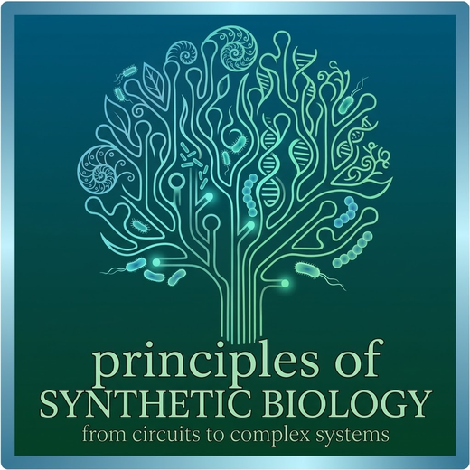

<div align="center">



# Principles of Synthetic Biology

**BioE 147 / BioE 247 · University of California, Berkeley · Fall 2026**
Adam P. Arkin · [arkinlab.bio](https://arkinlab.bio)

*Lectures, executable notebooks, and a small Python package for
building and analysing biological circuits from first principles.*

[](https://github.com/ArkinLaboratory/posb2026/actions/workflows/ci.yml)
[](LICENSE-CODE)
[](LICENSE)

</div>

---

## What this is

A one-semester graduate and upper-division undergraduate course on the design
of synthetic biological systems, rebuilt for 2026. The organising question is
narrow and specific:

> **Can we specify what we want a biological system to do, and then build a cell that does it?**

Thirty years in, the answer is *partially*. The substance of the field lives in
that word, and this course is about where the specification-to-implementation
pipeline works, where it breaks, and why.

**Everything here is free, executable, and self-contained.** If you are not
enrolled at Berkeley you can still work through the whole thing — every
notebook runs in a browser with no installation, and every derivation the
course relies on is worked rather than asserted.

## Where to go

| I want to… | Go to |
|---|---|
| Start working through the material | **[Getting Started](docs/getting-started.md)** |
| See the whole course at a glance | **[Course Map](docs/course-map.md)** — all 28 sessions |
| Browse the notebooks | [`sessions/`](sessions/) |
| Run a live classroom demo | [`demos/`](demos/) |
| Do the problem sets | [`problem-sets/`](problem-sets/) |
| Look up a function in `posb` | **[Package Reference](docs/posb-reference.md)** |
| Understand *why* it is built this way | **[Design Notes](docs/design-notes.md)** |
| See how a lecture is structured | **[Lecture Design](docs/lecture-design.md)** |
| Generate a figure or build a demo | **[Figures, Demos, and Decks](docs/figures-and-decks.md)** |
| Set up / run the course | **[Instructor Setup](docs/instructor-setup.md)** |
| Reuse this in my own course | **[For Instructors](docs/for-instructors.md)** |
| Look up a citation | **[References](docs/references.md)** |
| See what's built and what's next | **[Status and Roadmap](docs/roadmap.md)** |
| Report an error | [CONTRIBUTING.md](CONTRIBUTING.md) |

## Quick start

**No installation required.** Pick either:

- **Berkeley students —** [open the repository in DataHub](https://datahub.berkeley.edu/hub/user-redirect/git-pull?repo=https://github.com/ArkinLaboratory/posb2026&branch=main&urlpath=lab/tree/posb2026). Sign in with CalNet. That is the whole setup.
- **Everyone else —** click any [](https://colab.research.google.com/github/ArkinLaboratory/posb2026/blob/main/sessions/s03-modeling-i/s03_modeling_i.ipynb) badge. You need a Google account and nothing else.

Start with **[PS0 — Environment Check](problem-sets/ps00-environment/)** (ten
minutes, proves your setup works), then
**[Session 3 — Modeling I](sessions/s03-modeling-i/)**.

## The structure of the course

The semester is two halves that do different work.

**Sessions 1–14 — Design principles.** *What can a circuit do, and why is it
built that way?* Mass action and timescale separation, regulation functions
derived from equilibrium binding, phase-plane analysis, bistability,
feedforward loops, oscillation, stochasticity, and the digital abstraction.
The goal is that anyone — from any background — can take a circuit diagram,
write the equations, and determine its behaviour quantitatively.

**Sessions 16–28 — Engineering design.** *Now build one that survives in a
real host.* Implementation layers, resource competition and burden, metabolic
engineering and constraint-based design, retroactivity and insulation, feedback
control, evolutionary stability, multicellular consortia, minimal cells,
therapeutic circuits, machine-learning-based design, and biosecurity.

The hinge is the digital abstraction (session 13) followed immediately by why
design automation plateaued (session 16). Full detail in the
**[Course Map](docs/course-map.md)**.

## The `posb` package

A deliberately small library — plain NumPy and SciPy, no hidden solver, no
symbolic engine, no simulation framework. It exists to remove bookkeeping, not
to remove understanding. One design rule governs it:

> **Nothing in `posb` is abstracted away before it has been built by hand in class.**

Every module names the session that introduces it, and every notebook that
first uses a new abstraction proves numerically that it agrees with the
hand-written version. `posb/core.py` is about 250 lines including docstrings;
the function that builds the stoichiometric matrix is nine of them. **Read the
source.**

```python
from posb import Reaction, Model

# transcription, mRNA decay, translation (catalytic!), protein decay
cascade = Model(
    [
        Reaction({},             {"mRNA": 1},                k="alpha"),
        Reaction({"mRNA": 1},    {},                         k="gamma_m"),
        Reaction({"mRNA": 1},    {"mRNA": 1, "protein": 1},  k="k_p"),
        Reaction({"protein": 1}, {},                         k="gamma_p"),
    ],
    params={"alpha": 10.0, "gamma_m": 0.5, "k_p": 4.0, "gamma_p": 0.05},
)

print(cascade.summary())          # shows the network and its S matrix
traj = cascade.simulate({"mRNA": 0, "protein": 0}, (0, 200))
traj["protein"][-1]               # 1600.0
```

Full API in the **[Package Reference](docs/posb-reference.md)**.

## Repository layout

```
posb2026/
├── docs/                  Documentation — start with getting-started.md
├── posb/                  The package. core.py is the whole thing, for now.
├── sessions/              One folder per lecture, each with a README
│   └── s03-modeling-i/
├── problem-sets/          One folder per set (student versions)
│   ├── ps00-environment/
│   └── ps01-modeling/
├── demos/                 Interactive demos to drive live in lecture
│   └── d09-toggle-explorer/
├── figures/               Figure SOURCE. Slides embed figures/build/*.png
│   ├── style.py           the course palette, for matplotlib
│   └── s09_bistability.py
├── tools/                 Build and verification scripts
│   ├── sources/           ← SOURCE OF TRUTH for notebooks
│   ├── build_notebooks.py
│   └── execute_notebooks.py
└── tests/                 Unit tests for posb
```

**Notebooks are build artifacts.** They are generated from the Python modules
in `tools/sources/`. Do not hand-edit a `.ipynb` — see
[For Instructors](docs/for-instructors.md) for why that matters.

## Contributing and errata

Errors, unclear explanations, and broken links are all worth reporting —
[open an issue](https://github.com/ArkinLaboratory/posb2026/issues). Students
in the course: this counts, and you will be credited. See
[CONTRIBUTING.md](CONTRIBUTING.md).

## Licence

| Paths | Licence |
|---|---|
| `posb/`, `tools/`, `tests/` | [BSD 3-Clause](LICENSE-CODE) |
| `sessions/`, `problem-sets/`, `docs/`, all Markdown | [CC BY 4.0](LICENSE) |

You may use, adapt, and teach from this material, including commercially, with
attribution. If you teach a course from it, I would like to hear about it.

BSD-3-Clause rather than MIT because it is the licence the University of
California
[recommends considering first](https://security.ucop.edu/files/documents/resources/guide-to-managing-open-source-software.pdf)
for open-source releases, it is what comparable Berkeley course packages use,
and its non-endorsement clause fits an author with a dual university and
national-laboratory affiliation.

### Disclaimer

Developed for BioE 147/247 at the University of California, Berkeley. The views
expressed are those of the author and do not necessarily reflect those of the
University of California, The Regents of the University of California,
Lawrence Berkeley National Laboratory, or the U.S. Department of Energy.
Institutional affiliation is stated for identification only and does not imply
endorsement.

## Citation

See [CITATION.cff](CITATION.cff), or:

> Arkin, A. P. (2026). *Principles of Synthetic Biology: course materials for
> UC Berkeley BioE 147/247.* https://github.com/ArkinLaboratory/posb2026

## Related and recommended

- **[Biological Circuit Design](https://biocircuits.github.io)** — Elowitz &
  Bois, Caltech BE 150. Free, excellent, and covers much of this course's
  first half with a complementary framing. Every chapter has an executable
  appendix that regenerates its figures. Read it alongside this course.
- **Alon**, *An Introduction to Systems Biology*, 2nd ed. (CRC Press, 2019) —
  network motifs.
- **Del Vecchio & Murray**,
  *[Biomolecular Feedback Systems](https://www.cds.caltech.edu/~murray/BFSwiki/)*
  — free; the reference for retroactivity and control.

Full citations with BibTeX: **[References](docs/references.md)**.
