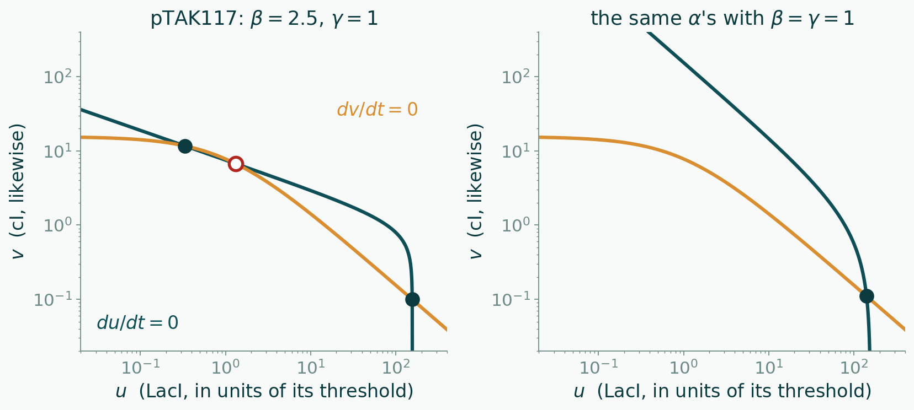

<!--
title: Session 8 — The switch Gardner built has γ = 1
subtitle: Two items in the room, two on PS4. The diagonal is gone; the argument is not.
session: 8
-->

# The switch Gardner built has γ = 1

Everything derived today used one shortcut: the toggle was symmetric, so the
fixed point sat on $u = v$ and the Jacobian read its own eigenvalues off. The
working device in the paper is not symmetric. From the Fig. 5 legend:

$$\alpha_1 = 156.25 \qquad \alpha_2 = 15.6 \qquad \beta = 2.5 \qquad \gamma = 1$$

with $u$ = LacI and $v$ = cI, each in units of its repression threshold:

$$\frac{du}{dt} = \frac{\alpha_1}{1 + v^{\beta}} - u
\qquad\qquad
\frac{dv}{dt} = \frac{\alpha_2}{1 + u^{\gamma}} - v$$

**LacI represses with no cooperativity at all.** The criterion you derived an
hour ago says a toggle with $n \le 1$ cannot switch at any promoter strength.
pTAK117 switches. **Items 1 and 2 in the room** — item 1 is worked, item 2 is
yours. Items 3 and 4 are **PS4**.

---

## 1 · Fully worked — where the symmetric criterion came from

Nothing about the Jacobian needed the diagonal. At any fixed point,

$$J = \begin{pmatrix} -1 & -g_1 \\ -g_2 & -1 \end{pmatrix},
\qquad
g_1 \equiv -\frac{\partial f}{\partial v} = \frac{\alpha_1 \beta v^{\beta-1}}{(1+v^{\beta})^2},
\qquad
g_2 \equiv -\frac{\partial g}{\partial u} = \frac{\alpha_2 \gamma u^{\gamma-1}}{(1+u^{\gamma})^2}.$$

The same move as the lecture clears each square. On the $u$-nullcline
$\alpha_1/(1+v^\beta) = u$, so

$$g_1 = \beta\,\frac{u\, v^{\beta-1}}{1+v^{\beta}},
\qquad\qquad
g_2 = \gamma\,\frac{v\, u^{\gamma-1}}{1+u^{\gamma}}.$$

The eigenvalues of that $J$ are $\lambda = -1 \pm \sqrt{g_1 g_2}$ — check it by
writing $\det(J - \lambda I) = 0$. So the fixed point is a saddle exactly when

$$\boxed{\;g_1\, g_2 > 1\;}$$

**That is the criterion.** In the lecture $g_1 = g_2 = g$ and it read $g > 1$;
the product is what was always there. Read it as a **loop gain**: how much a
nudge in $u$ comes back to $u$ after going once round the loop through $v$.

**Now put $\gamma = 1$ in it.** Then $g_2 = v/(1+u)$, and $g_1$ has a factor
$v^{\beta}/(1+v^{\beta}) < 1$, so

$$g_1 g_2 \;<\; \beta\,\frac{u}{v}\cdot\frac{v}{1+u} \;=\; \beta\,\frac{u}{1+u} \;<\; \beta .$$

The loop gain can exceed one only if $\beta > 1$. **Cooperativity has to be
somewhere, not everywhere.** With $\beta = \gamma = 1$ the bound is
$g_1 g_2 < 1$ at every crossing, for every $\alpha$: no crossing can ever be a
saddle, so there is one crossing and one state. That is Box 1's sentence —
*at least one of the inhibitors must repress with cooperativity greater than
one* — proved for the case $\gamma = 1$. The general condition is
$\beta\gamma > 1$; you meet it on PS4 as the condition for the bifurcation
line to exist at all.

**▶ Which curve is the hyperbola, and why is it drawn without an inflection?**
One sentence.

---

## 2 · The last step is yours — pTAK117's three crossings

`stability_report` on `toggle_model(156.25, 15.6, n=1, m=2.5)` finds:

| crossing | $u$ (LacI) | $v$ (cI) |
|---|---|---|
| A | 0.332 | 11.708 |
| B | 1.317 | 6.734 |
| C | 155.76 | 0.100 |

**▶ Compute $g_1 g_2$ at B** with the formulas of item 1 ($\beta = 2.5$,
$\gamma = 1$). Three significant figures, then the two eigenvalues.

**▶ At C, $g_1$ is enormous and $g_2$ is tiny.** Say in words why the product,
not either factor, decides — and which protein is "in charge" of the C state.

**▶ The paper says the low state is more stable than the high state**
(*the rate of Lac repressor synthesis is more than an order of magnitude higher
than the rate of λ repressor synthesis*). Which of A and C is the low state,
and what in your two loop gains agrees with the paper's sentence?

---

## 3 · On PS4 — pIKE105, the one that did not switch

Six toggle variants — four pTAK, two pIKE — were built by swapping the RBS
in front of *lacI* (RBS1 in Fig. 3), with the promoters unchanged. All four
pTAK are bistable; of the two pIKE, only pIKE107 is. pIKE105 is not, and the
paper says why: TetR is a weaker repressor than cI, so the P$_\text{LtetO-1}$
arm had to be weakened relative to P$_\text{Ls1con}$, and in pIKE105 it was
not weakened enough. (The paper calls this the strength of the promoter; what
physically differs is the RBS, and the arm is what the model sees.)

Translate that sentence into the model. Which of $\alpha_1$, $\alpha_2$,
$\beta$, $\gamma$ does an RBS swap move, and which way did pIKE105 sit relative
to the wedge on the last figure of the lecture? Draw its nullclines
qualitatively — one crossing — and say which state it is stuck in. Then say
what a *second* RBS swap would have to do to rescue it.

---

## 4 · On PS4 — one ssrA tag, and the end of $\tau = -2$

Tag cI, and only cI, with ssrA so it is removed three times faster than LacI.
Time is still measured in LacI lifetimes. Write the two equations, find the
Jacobian at a fixed point, and show that the saddle condition becomes

$$g_1 g_2 > \delta_1 \delta_2$$

where $\delta_1$, $\delta_2$ are the two scaled removal rates. Then say what
the tag does to the bistable wedge in the $(\alpha_2, \alpha_1)$ plane, and
what you would change to put pTAK117 back inside it. This is Thursday's
ConcepTest, done properly.

